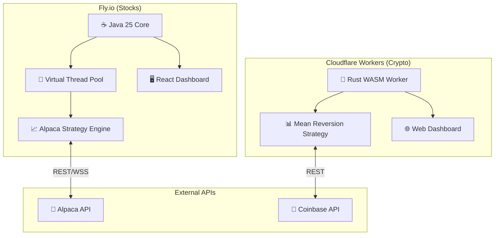

# ⚡ Algo Trading Platform: Multi-Asset Autonomous Trading System

**Enterprise-grade algorithmic trading engine for Stocks (Alpaca/Java) and Crypto (Coinbase/Rust), with modern cloud deployment.**


## 📖 Executive Summary

This project is a **full-stack, high-concurrency multi-asset trading platform** supporting:
- **Stocks**: Alpaca Securities API (US markets) - Java/Fly.io
- **Crypto**: Coinbase Advanced Trade API (24/7 trading) - Rust/Cloudflare Workers

The stock trading engine leverages **Java 25's Virtual Threads (Project Loom)** for high-concurrency market data processing. The crypto bot runs on Cloudflare's edge network for ultra-low latency and 99.99% uptime.

## 🏗 System Architecture

The platform consists of two independent services:
1. **Java Trading Bot** (Fly.io) - Stock trading with embedded React dashboard
2. **Rust Crypto Worker** (Cloudflare) - 24/7 crypto trading with web UI



## 🛠 Technology Stack

### 🧠 Stock Trading Backend (Java)

- **Language:** Java 25 (LTS) with Virtual Threads (Project Loom)
- **Framework:** Javalin - lightweight web framework (sub-1ms overhead)
- **Build:** Maven with Shade plugin for uber-JAR
- **Resilience:** Circuit breakers (Resilience4j), heartbeat monitoring, emergency protocol
- **Deployment:** Fly.io (containerized)

### 🦀 Crypto Trading Backend (Rust)

- **Language:** Rust 2024 Edition (1.85+)
- **Platform:** Cloudflare Workers (WASM)
- **Strategy:** Mean reversion with ATR-based TP/SL
- **Risk Management:** 2% risk per trade, 25% max per position
- **Cost:** ~$5/month

### 💻 Frontend: Command & Control Dashboard
- **Framework:** React 19 + TypeScript + Vite
- **State:** Zustand for lightweight state management
- **Charts:** Lightweight Charts (v5) + Recharts
- **Real-time:** WebSocket for sub-50ms latency updates

## 🧩 Key Features

### 1. Multi-Profile Trading (Alpaca)
- **MAIN Profile**: Conservative, momentum-based trading
- **EXPERIMENTAL Profile**: Aggressive, volatility-adjusted strategies
- **Kelly Criterion**: Dynamic position sizing based on edge estimation
- **VIX Integration**: Automatic strategy adjustment based on market fear

### 2. Coinbase Crypto Trading (24/7)
- **Mean Reversion**: Buy the dip with trend/volume filters
- **Volatility-Adaptive TP/SL**: ATR-based dynamic exits (2:1 R:R)
- **Risk-Based Sizing**: 2% risk per trade, 25% max per position
- **Time-Based Exits**: Auto-close stale positions after 12h
- **Web Dashboard**: Real-time portfolio at `/dashboard`

### 3. Risk Management
- **Emergency Protocol**: Manual panic button to flatten all positions
- **Heartbeat Monitoring**: System health checks every 5 seconds
- **PDT Protection**: Pattern day trader safeguards (Alpaca)
- **Position Tracking**: Real-time P&L monitoring with entry prices

### 4. Adaptive Capital-Tier Risk Management (NEW)
- **BracketOrderResult**: Tracks whether server-side SL/TP protection was applied
- **CapitalTierManager**: Automatic risk adjustment based on account size
  - MICRO (<$500): Ultra-conservative, max 2 positions, prefer whole shares
  - SMALL ($500-$2K): Conservative, 3 positions, whole shares for bracket protection
  - MEDIUM ($2K-$5K): Balanced, 4 positions
  - STANDARD ($5K-$25K): Full trading capabilities
  - PDT ($25K+): Unrestricted day trading
- **PositionProtectionAuditor**: Monitors positions without broker-side protection
  - Telegram alerts when fractional orders skip bracket protection
  - WebSocket broadcasts to dashboard for real-time UI warnings
- **Dashboard Warning**: Positions without bracket orders show "⚠️ No Bracket" indicator

## 🚀 Getting Started

### Prerequisites
- Java 25 JDK (Temurin or GraalVM)
- Rust toolchain (for crypto bot)
- Node.js 20+
- Docker
- API Keys: Alpaca + Coinbase

### Local Development (Stock Bot)
```bash
# Clone and navigate
cd trading-backend

# Build dashboard
cd dashboard && npm install && npm run build && cd ..

# Set environment variables
export ALPACA_API_KEY=your_key
export ALPACA_API_SECRET=your_secret

# Build and run
mvn clean package -DskipTests
java --enable-preview -jar target/trading-backend-1.0-SNAPSHOT.jar
```

### Local Development (Crypto Bot)
```bash
cd coinbase-worker

# Set secrets
wrangler secret put COINBASE_API_KEY_NAME
wrangler secret put COINBASE_PRIVATE_KEY

# Run locally
wrangler dev

# Deploy
wrangler deploy
```

### Deployment
- **Stocks (Fly.io)**: `cd trading-backend && flyctl deploy`
- **Crypto (Cloudflare)**: `cd coinbase-worker && wrangler deploy`

## 📡 API Endpoints

### Stock Bot (Java/Fly.io)

| Endpoint | Method | Description |
|----------|--------|-------------|
| `/api/health` | GET | System health check |
| `/api/heartbeat` | GET | Component heartbeat status |
| `/api/status` | GET | Bot running status |
| `/api/account` | GET | Alpaca account info |
| `/api/positions` | GET | Current stock positions |
| `/api/orders` | GET | Open orders |
| `/api/emergency/panic` | POST | Flatten ALL positions |
| `/api/emergency/reset` | POST | Reset emergency state |

### Crypto Bot (Rust/Cloudflare)

| Endpoint | Method | Description |
|----------|--------|-------------|
| `/` | GET | Dashboard UI |
| `/health` | GET | Health check |
| `/api/portfolio` | GET | Portfolio with live P&L |
| `/api/positions` | GET | Current positions |
| `/api/scan` | GET | Market scan results |
| `/api/trigger` | POST | Force trading cycle |
| `/api/toggle` | POST | Enable/disable trading |

## 📦 Project Structure
```
.
├── trading-backend/             # Java Stock Trading Bot
│   ├── src/main/java/com/trading/
│   │   ├── api/controller/      # REST API controllers
│   │   ├── bot/                 # Main TradingBot orchestrator
│   │   ├── broker/              # Alpaca client, BrokerRouter
│   │   ├── portfolio/           # ProfileManager, strategies
│   │   ├── protection/          # EmergencyProtocol
│   │   └── risk/                # Risk management
│   ├── dashboard/               # React frontend (embedded)
│   ├── Dockerfile               # Multi-stage build
│   └── fly.toml                 # Fly.io config
│
├── coinbase-worker/             # Rust Crypto Trading Bot
│   ├── src/
│   │   ├── lib.rs               # Entry point, HTTP routes
│   │   ├── auth.rs              # Coinbase JWT auth
│   │   ├── client.rs            # Coinbase API client
│   │   ├── strategy.rs          # Trading logic
│   │   ├── trading.rs           # Trading engine
│   │   └── dashboard/           # Web UI
│   ├── wrangler.toml            # Cloudflare config
│   └── README.md                # Crypto bot docs
│
└── README.md                    # This file
```

## ⚙️ Configuration

### Stock Bot (config.properties)
```properties
# Alpaca Profiles
MAIN_TAKE_PROFIT_PERCENT=0.02
MAIN_STOP_LOSS_PERCENT=0.01
```

### Crypto Bot (wrangler.toml)
```toml
ATR_SL_MULTIPLIER = "1.0"      # SL at 1x ATR
ATR_TP_MULTIPLIER = "2.0"      # TP at 2x ATR (2:1 R:R)
MAX_RISK_PER_TRADE_PERCENT = "2.0"
MAX_PORTFOLIO_PER_POSITION = "25.0"
SYMBOLS = "BTC-USD,ETH-USD,SOL-USD,..."
```

## 🔒 Security Notes
- API keys stored in `config.properties` (git-ignored)
- Use `config.properties.template` as reference
- Cloud Run uses Secret Manager (recommended for production)

---

## 👨‍💻 Author
Built by **Ihor Petrov** as a research project in **Low-Latency Java Systems** and **Algorithmic Trading**.

Open to consulting in FinTech, Algo-Trading, and High-Performance Systems.
