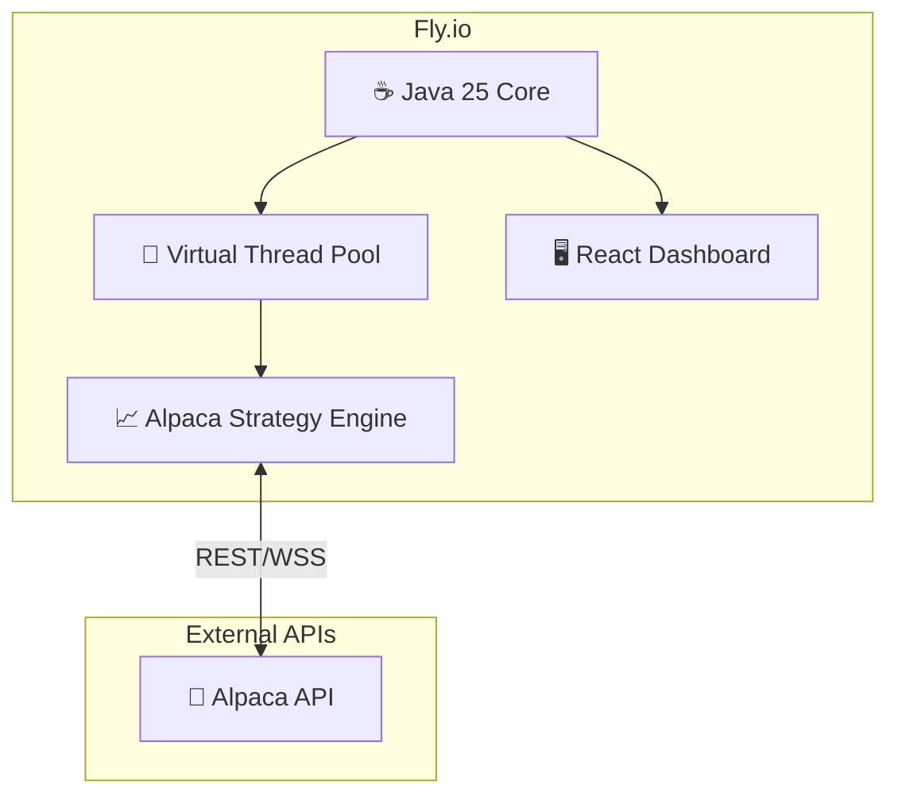

# ⚡ Algo Trading Platform: Autonomous Stock Trading System

**Algorithmic trading engine for US Stocks via Alpaca API, with modern cloud deployment.**

---

## 🗂 Active Development Session

> **To continue this work from another machine**, open Claude Code and load this project. The conversation below summarises all recent context — paste it as your first message, or just read it and start asking questions.

### Last session: May 29–30, 2026

**Session transcript (Claude Code VSCode, project: algo-trading-platform)**
Session ID: `f2a6edac-d025-440d-8f24-4144af5a4567`
Transcript file (local): `.claude/projects/.../f2a6edac-d025-440d-8f24-4144af5a4567.jsonl`

#### What was built in this session

**9 bot fixes deployed (commit `a9cac015` + `8f5f2d1b` + `6c6ae98e`):**
1. Double-entry race guard — `pendingBuySymbols` map prevents duplicate orders in back-to-back cycles
2. Position sizing hard cap — notional never exceeds `equity × tierMaxPositionPercent` before order placement
3. Orphan P&L recovery — fetches Alpaca order history before marking trades CANCELLED, records real fill price
4. Daily loss circuit breaker — `DAILY_MAX_LOSS_ENABLED=true`, `DAILY_MAX_LOSS_PERCENT=3.0` (stops new entries if 3% lost today)
5. Regime-aware exits — in WEAK_BEAR/STRONG_BEAR: tightens profitable longs to breakeven, exits losing longs >0.5%
6. Win rate dashboard fix — `/api/trades/stats` was always returning 0% win rate
7. Partial-exit mask restored on restart — `partialExitsExecuted` field now survives redeploys
8. N×DB queries reduced — `getOpenTradeRecords()` hoisted outside the exit loop (1 query/cycle not N)
9. `getTodayPnL()` — analytics endpoint now shows today's P&L, not all-time total

**Volume profile + ATR TP cap fixes (commit `09d6872d`):**
- Volume profile check is now a hard entry block (was warn-only)
- ATR TP capped at `min(ATR-based TP, profile.takeProfitPercent%)` — was producing 8.5% TP instead of configured 3%

**27 new unit tests added (commit `e78af8e8`)** covering all 9 fixes above.

#### Scheduled tasks

| Routine | Fires | What it does |
|---------|-------|-------------|
| [PDT abolition prep](https://claude.ai/code/routines/trig_01XGJTP21jjbPqAANpU783cN) | June 3, 2026 5:00 PM ET | Applies all 4 config changes, commits, pushes, attempts deploy. See [full plan](docs/JUNE3_PDT_PLAN.md). |

**After the routine fires on June 3:** check https://claude.ai/code/routines/trig_01XGJTP21jjbPqAANpU783cN for result.
If deploy wasn't done automatically, run: `cd trading-backend && ~/.fly/bin/fly deploy --remote-only --app trading-bot-igor-waw`

#### Current bot state
- **App:** `trading-bot-igor-waw` on Fly.io (region: iad)
- **Broker:** Alpaca only (`BROKERS=alpaca:100`), Tradier hard-disabled
- **Account:** ~$1,175 live equity, SMALL tier (35% max per position, 3 positions max)
- **Regime:** WEAK_BEAR (62% confidence) as of May 30
- **Open position:** SPY ×2 lots, entry ~$753.48, SL $738.91, TP $776.11
- **Win rate:** 11.8% (6W/45L) — strategy under review
- **PDT:** Currently enabled; being removed June 4 when FINRA rule abolished

#### Next optimization priorities (PDT-related — see below)
1. Reduce `MIN_HOLD_TIME_HOURS` from 4 → 1 after June 4
2. Enable `EOD_EXIT_ENABLED=true` for intraday profit-locking
3. Consider tighter stops (1.0% vs 1.5%) since same-day re-entry is free post-PDT
4. Review MACD strategy win rate — 11.8% is too low regardless of PDT

---


## 📖 Executive Summary

This project is a **full-stack, high-concurrency stock trading platform** using the Alpaca Securities API (US markets).

The trading engine leverages **Java 25's Virtual Threads (Project Loom)** for high-concurrency market data processing, deployed on Fly.io with an embedded React dashboard.

## 🏗 System Architecture


```mermaid
graph TD
    subgraph "Fly.io"
        JavaCore["☕ Java 25 Core"]
        VirtualThreads["🧵 Virtual Thread Pool"]
        AlpacaStrategy["📈 Alpaca Strategy Engine"]
        Dashboard["🖥️ React Dashboard"]

        JavaCore --> VirtualThreads
        VirtualThreads --> AlpacaStrategy
        JavaCore --> Dashboard
    end

    subgraph "External APIs"
        AlpacaAPI["📡 Alpaca API"]
    end

    AlpacaStrategy <-->|REST/WSS| AlpacaAPI
```

## 🛠 Technology Stack

### 🧠 Trading Backend (Java)

- **Language:** Java 25 (LTS) with Virtual Threads (Project Loom)
- **Framework:** Javalin - lightweight web framework (sub-1ms overhead)
- **Build:** Maven with Shade plugin for uber-JAR
- **Resilience:** Circuit breakers (Resilience4j), heartbeat monitoring, emergency protocol
- **Deployment:** Fly.io (containerized)

### 💻 Frontend: Command & Control Dashboard
- **Framework:** React 19 + TypeScript + Vite
- **State:** Zustand for lightweight state management
- **Charts:** Lightweight Charts (v5) + Recharts
- **Real-time:** WebSocket for sub-50ms latency updates

## 🧩 Key Features

### 1. Multi-Profile Trading
- **MAIN Profile**: Conservative, momentum-based trading
- **EXPERIMENTAL Profile**: Aggressive, volatility-adjusted strategies
- **Kelly Criterion**: Dynamic position sizing based on edge estimation
- **VIX Integration**: Automatic strategy adjustment based on market fear

### 2. Risk Management
- **Emergency Protocol**: Manual panic button to flatten all positions
- **Heartbeat Monitoring**: System health checks every 5 seconds
- **PDT Protection**: Pattern day trader safeguards
- **Position Tracking**: Real-time P&L monitoring with entry prices

### 3. Adaptive Capital-Tier Risk Management
- **BracketOrderResult**: Tracks whether server-side SL/TP protection was applied
- **CapitalTierManager**: Automatic risk adjustment based on account size
  - MICRO (<$500): Ultra-conservative, max 2 positions, prefer whole shares
  - SMALL ($500-$2K): Conservative, 3 positions, whole shares for bracket protection
  - MEDIUM ($2K-$5K): Balanced, 4 positions
  - STANDARD ($5K-$25K): Full trading capabilities
  - PDT ($25K+): Unrestricted day trading
- **PositionProtectionAuditor**: Monitors positions without broker-side protection
  - Telegram alerts when fractional orders skip bracket protection
  - WebSocket broadcasts to dashboard for real-time UI warnings
- **Dashboard Warning**: Positions without bracket orders show "⚠️ No Bracket" indicator

## 🚀 Getting Started

### Prerequisites
- Java 25 JDK (Temurin or GraalVM)
- Node.js 20+
- Docker
- Alpaca API Keys

### Local Development
```bash
# Clone and navigate
cd trading-backend

# Build dashboard
cd dashboard && npm install && npm run build && cd ..

# Set environment variables
export ALPACA_API_KEY=your_key
export ALPACA_API_SECRET=your_secret

# Build and run
mvn clean package -DskipTests
java --enable-preview -jar target/trading-backend-1.0-SNAPSHOT.jar
```

### Deployment
```bash
cd trading-backend && flyctl deploy
```

## 📡 API Endpoints

| Endpoint | Method | Description |
|----------|--------|-------------|
| `/api/health` | GET | System health check |
| `/api/heartbeat` | GET | Component heartbeat status |
| `/api/status` | GET | Bot running status |
| `/api/account` | GET | Alpaca account info |
| `/api/positions` | GET | Current stock positions |
| `/api/orders` | GET | Open orders |
| `/api/emergency/panic` | POST | Flatten ALL positions |
| `/api/emergency/reset` | POST | Reset emergency state |

## 📦 Project Structure
```
.
├── trading-backend/             # Java Stock Trading Bot
│   ├── src/main/java/com/trading/
│   │   ├── api/controller/      # REST API controllers
│   │   ├── bot/                 # Main TradingBot orchestrator
│   │   ├── broker/              # Alpaca client, BrokerRouter
│   │   ├── portfolio/           # ProfileManager, strategies
│   │   ├── protection/          # EmergencyProtocol
│   │   └── risk/                # Risk management
│   ├── dashboard/               # React frontend (embedded)
│   ├── Dockerfile               # Multi-stage build
│   └── fly.toml                 # Fly.io config
│
└── README.md                    # This file
```

## ⚙️ Configuration

### config.properties
```properties
# Alpaca Profiles
MAIN_TAKE_PROFIT_PERCENT=2.0
MAIN_STOP_LOSS_PERCENT=1.0
MAX_POSITIONS_AT_ONCE=5
MIN_HOLD_TIME_HOURS=4
```

## 🔒 Security Notes
- API keys stored in `config.properties` (git-ignored)
- Use `config.properties.template` as reference

---

## 👨‍💻 Author
Built by **Ihor Petrov** as a research project in **Low-Latency Java Systems** and **Algorithmic Trading**.

Open to consulting in FinTech, Algo-Trading, and High-Performance Systems.
