# ⚡ Algo Trading Platform: Multi-Asset Autonomous Trading System

**Enterprise-grade algorithmic trading engine for Stocks (Alpaca) and Crypto (Kraken), built on Java 25 (Virtual Threads) and React 19.**


## 📖 Executive Summary

This project is a **full-stack, high-concurrency multi-asset trading platform** supporting:
- **Stocks**: Alpaca Securities API (US markets)
- **Crypto**: Kraken Exchange API (24/7 trading)

Unlike typical retail bots written in Python, this system leverages **Java 25's Virtual Threads (Project Loom)** to handle thousands of concurrent market data streams with microsecond-level overhead.

## 🏗 System Architecture

The system is a **unified monolith** deployed to Google Cloud Run, combining the execution engine with an embedded React dashboard.

```mermaid
graph TD
    subgraph "Google Cloud Run"
        JavaCore["☕ Java 25 Core"]
        VirtualThreads["🧵 Virtual Thread Pool"]
        AlpacaStrategy["📈 Alpaca Strategy Engine"]
        KrakenStrategy["🦑 Kraken Trading Loop"]
        Dashboard["🖥️ React Dashboard (Embedded)"]
        
        JavaCore --> VirtualThreads
        VirtualThreads --> AlpacaStrategy
        VirtualThreads --> KrakenStrategy
        JavaCore --> Dashboard
    end

    subgraph "External APIs"
        AlpacaAPI["📡 Alpaca API"]
        KrakenAPI["🦑 Kraken API"]
    end

    AlpacaStrategy <-->|REST/WSS| AlpacaAPI
    KrakenStrategy <-->|REST| KrakenAPI
    Dashboard <-->|WebSocket| JavaCore
```



## 🛠 Technology Stack

### 🧠 Backend: The Execution Core
- **Language:** Java 25 (LTS) with Virtual Threads (Project Loom)
- **Framework:** Javalin - lightweight web framework (sub-1ms overhead)
- **Build:** Maven with Shade plugin for uber-JAR
- **Resilience:** Circuit breakers (Resilience4j), heartbeat monitoring, emergency protocol

### 💻 Frontend: Command & Control Dashboard
- **Framework:** React 19 + TypeScript + Vite
- **State:** Zustand for lightweight state management
- **Charts:** Lightweight Charts (v5) + Recharts
- **Real-time:** WebSocket for sub-50ms latency updates

### ☁️ Infrastructure
- **Deployment:** Google Cloud Run (serverless containers)
- **Registry:** Google Artifact Registry
- **Container:** Docker with GraalVM JDK 25

## 🧩 Key Features

### 1. Multi-Profile Trading (Alpaca)
- **MAIN Profile**: Conservative, momentum-based trading
- **EXPERIMENTAL Profile**: Aggressive, volatility-adjusted strategies
- **Kelly Criterion**: Dynamic position sizing based on edge estimation
- **VIX Integration**: Automatic strategy adjustment based on market fear

### 2. Kraken Crypto Trading (24/7)
- **Grid Trading**: Automated buy/sell grid with dynamic sizing
- **Stop-Loss/Take-Profit**: Configurable SL (0.5%) and TP (0.75%) per position
- **Volatility Detection**: Position sizing adjusted for high-volatility periods
- **Selective Liquidation**: Close only losing positions on demand

### 3. Risk Management
- **Emergency Protocol**: Manual panic button to flatten all positions
- **Heartbeat Monitoring**: System health checks every 5 seconds
- **PDT Protection**: Pattern day trader safeguards (Alpaca)
- **Position Tracking**: Real-time P&L monitoring with entry prices

## 🚀 Getting Started

### Prerequisites
- Java 25 JDK (Temurin or GraalVM)
- Node.js 20+
- Docker
- Google Cloud SDK (for deployment)
- API Keys: Alpaca + Kraken

### Local Development
```bash
# Clone and navigate
cd trading-backend

# Build dashboard
cd dashboard && npm install && npm run build && cd ..

# Set environment variables
export ALPACA_API_KEY=your_key
export ALPACA_API_SECRET=your_secret
export KRAKEN_API_KEY=your_key
export KRAKEN_API_SECRET=your_secret

# Build and run
mvn clean package -DskipTests
java --enable-preview -jar target/trading-backend-1.0-SNAPSHOT.jar
```

### Deployment (Google Cloud Run)
```bash
# Build with Cloud Build (for amd64)
gcloud builds submit --project=YOUR_PROJECT \
  --tag us-central1-docker.pkg.dev/YOUR_PROJECT/YOUR_REPO/algo-trading-backend:latest

# Deploy
gcloud run deploy algo-trading-backend \
  --project=YOUR_PROJECT \
  --region=us-central1 \
  --image=us-central1-docker.pkg.dev/YOUR_PROJECT/YOUR_REPO/algo-trading-backend:latest \
  --allow-unauthenticated
```

## 📡 API Endpoints

### Health & Status
| Endpoint | Method | Description |
|----------|--------|-------------|
| `/api/health` | GET | System health check |
| `/api/heartbeat` | GET | Component heartbeat status |
| `/api/status` | GET | Bot running status |

### Alpaca (Stocks)
| Endpoint | Method | Description |
|----------|--------|-------------|
| `/api/account` | GET | Alpaca account info |
| `/api/positions` | GET | Current stock positions |
| `/api/orders` | GET | Open orders |

### Kraken (Crypto)
| Endpoint | Method | Description |
|----------|--------|-------------|
| `/api/kraken/balance` | GET | Kraken wallet balance |
| `/api/kraken/holdings` | GET | Crypto holdings with prices |
| `/api/kraken/positions` | GET | Margin positions |
| `/api/kraken/grid` | GET | Grid trading status |
| `/api/kraken/liquidate-losers` | POST | Sell only losing positions |

### Emergency Controls
| Endpoint | Method | Description |
|----------|--------|-------------|
| `/api/emergency/panic` | POST | Flatten ALL Alpaca positions |
| `/api/emergency/reset` | POST | Reset emergency state |
| `/api/emergency/status` | GET | Emergency protocol status |

## 📦 Project Structure
```
trading-backend/
├── src/main/java/com/trading/
│   ├── api/controller/      # REST API controllers
│   ├── bot/                 # Main TradingBot orchestrator
│   ├── broker/              # KrakenClient, BrokerRouter
│   ├── crypto/              # KrakenTradingLoop (24/7)
│   ├── portfolio/           # ProfileManager, strategies
│   ├── protection/          # EmergencyProtocol, HeartbeatMonitor
│   └── strategy/            # GridTradingService, algorithms
├── dashboard/               # React frontend (embedded)
│   ├── src/components/      # UI widgets
│   └── dist/                # Built assets (copied to JAR)
├── Dockerfile               # Multi-stage build
├── pom.xml                  # Maven configuration
└── config.properties        # Trading parameters
```

## ⚙️ Configuration (config.properties)

```properties
# Kraken Trading
KRAKEN_STOP_LOSS_PERCENT=0.5
KRAKEN_TAKE_PROFIT_PERCENT=0.75
KRAKEN_CYCLE_INTERVAL_MS=10000

# Grid Trading
GRID_ORDER_SIZE=100.0
GRID_VOLATILITY_THRESHOLD=0.02

# Alpaca Profiles
MAIN_TAKE_PROFIT_PERCENT=0.02
MAIN_STOP_LOSS_PERCENT=0.01
```

## 🔒 Security Notes
- API keys stored in `config.properties` (git-ignored)
- Use `config.properties.template` as reference
- Cloud Run uses Secret Manager (recommended for production)

---

## 👨‍💻 Author
Built by **Ihor Petrov** as a research project in **Low-Latency Java Systems** and **Algorithmic Trading**.

Open to consulting in FinTech, Algo-Trading, and High-Performance Systems.
