# ⚡ Alpaca Bot: Autonomous High-Frequency Trading System

**Enterprise-grade algorithmic trading engine built on Java 25 (Virtual Threads) and React 19.**

## 📖 Executive Summary
This project represents a **full-stack, high-concurrency trading platform** designed for the Alpaca Securities API. Unlike typical retail bots usually written in Python, this system leverages **Java 25's Virtual Threads (Project Loom)** to handle thousands of concurrent market data streams with microsecond-level overhead. It features a self-healing "Watchdog" architecture and a real-time Command & Control dashboard.

## 🏗 System Architecture

The system follows a **modern/hybrid microservice architecture**, separating the execution core from the observability layer.

```mermaid
graph TD
    subgraph "Execution Plane (GCP Cloud Run)"
        JavaCore["☕ Java 25 Core"]
        VirtualThreads["🧵 Virtual Thread Pool"]
        Strategy["🧠 Strategy Engine"]
        
        JavaCore --> VirtualThreads
        VirtualThreads --> Strategy
    end

    subgraph "Edge Plane (Cloudflare Workers)"
        RustCortex["🦀 Rust Cortex (WASM)"]
        EdgeFilter["🛡️ Pre-Trade Filter"]
        DeadManSwitch["💀 Dead Man's Switch"]

        RustCortex --> EdgeFilter
        RustCortex --> DeadManSwitch
    end

    subgraph "Control Plane (Cloudflare Pages)"
        Dashboard["🖥️ React Command Center"]
        State["⚡ Real-Time WebSocket"]
    end

    subgraph "Data Plane"
        AlpacaAPI["📡 Alpaca Market Data"]
    end

    JavaCore <-->|Heartbeat| RustCortex
    RustCortex -->|Emergency Flatten| AlpacaAPI
    JavaCore <-->|REST/WSS| AlpacaAPI
    JavaCore <-->|Secure WSS| Dashboard
```

## 🛠 Technology Stack Breakdown

### 🧠 Backend: The Execution Core
*   **Language:** Java 25 (LTS) - Selected for strict typing and performance.
*   **Concurrency:** **Virtual Threads** (Project Loom) instead of Reactive Streams. This allows blocking I/O (API calls) to be written in a simple imperative style while maintaining non-blocking runtime characteristics.
*   **Framework:** **Javalin** - Extremely lightweight web framework (sub-1ms overhead).
*   **Resilience:** Custom "Watchdog" implementation that monitors heartbeat, memory pressure, and API latency, capable of "Emergency Flattening" positions if critical thresholds are breached.

### 🛡️ Edge / Safety: The Rust Cortex
*   **Language:** Rust (compiled to WASM).
*   **Platform:** Cloudflare Workers (Serverless Edge).
*   **Role:** Acts as an independent "Dead Man's Switch". If the Java Core crashes or loses connection for >3 minutes, this Rust worker automatically triggers an "Emergency Flatten" to close all positions directly via Alpaca API, bypassing the core entirely.
*   **Performance:** <10ms cold start, running globally at the edge.

### 💻 Frontend: Command & Control
*   **Framework:** React 19 + TypeScript + Vite.
*   **State Management:** **Zustand** for lightweight, atomic state updates.
*   **Visualization:**
    *   **Lightweight Charts (v5):** For high-performance financial timeseries rendering (used in Backtest Lab).
    *   **Recharts:** For real-time P&L visualization.
*   **Communication:** Raw WebSockets for sub-50ms latency updates from the Core.

## 🧩 Key Solutions & Features

### 1. The Strategy Research Lab
A built-in **Backtesting Engine** allows for rapid strategy verification without risking capital.
*   **Dual Mode:** Supports both **Real Market Data** (historical re-simulation) and **Mock Data** (Algorithmic Noise Generation) for offline UI testing.
*   **Metrics:** Calculates **Sharpe Ratio**, **Max Drawdown**, and **Win Rate** instantly.
*   **Optimization:** Configurable Take Profit / Stop Loss parameters to tune outcomes.

### 2. Autonomous Market Regime Detection
The bot doesn't just trade blindly; it detects the **Context**:
*   **VIX Volatility Analysis:** Automatically switches strategies based on fear index (VIX).
*   **Regime Classification:** Identifies `BULLISH`, `BEARISH`, or `SIDELINE` markets and adjusts position sizing (Kelly Criterion) dynamically.

### 3. Reliability First
*   **Self-Healing:** The system monitors its own connection health.
*   **PDT Protection:** Built-in pattern day trader protection logic to prevent account locks.
*   **Cloud Native:** Containerized with **Docker** and deployed to **Google Cloud Run** for serverless scalability.

## 🚀 Getting Started

### Prerequisites
*   Java 25 JDK
*   Node.js 20+
*   Docker
*   Alpaca API Keys (Live or Paper)

### Deployment
The system is designed for **GitOps** deployment:
1.  **Backend:** `gcloud run deploy alpaca-bot-core`
2.  **Frontend:** `wrangler pages deploy dist`

## 📦 Project Structure
- `alpaca-bot-core/` - The high-performance Java execution engine.
- `watchdog-worker/` - The Rust/WASM safety cortex deployed to Cloudflare Workers.
- `test-trade/dashboard/` - The React-based Command & Control interface.

---

## 👨‍💻 About the Author
Built by [Ihor Petrov] as a specialized research project into **Low-Latency Java Systems** and **React-based Financial Visualization**. Open to consulting in FinTech, Algo-Trading, and High-Performance Systems.
